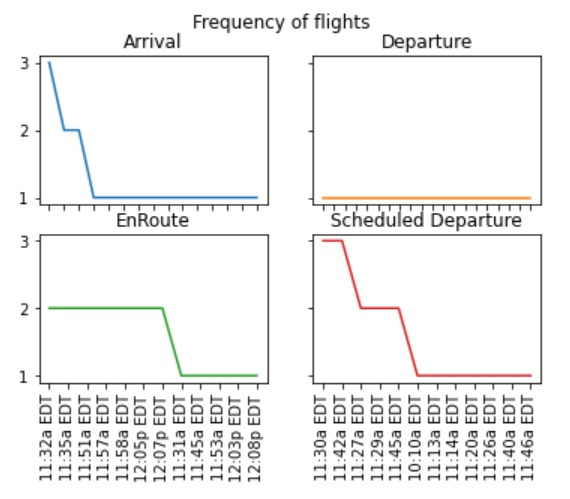

# Arrival & Departure flight details at JFK Intl Airport

Authors:  **Amar** and **Ashwin**

## Introduction
We have imported data from 'https://flightaware.com/live/airport/KJFK'. 
This website updates the arrival, departure, en-route and scheduled departure of flights from any airport around the world. 
We have chosen 'JFK Intl Airport' for our study. 
The type of data is list which was late converted in to pandas dataframe.
The website constantly updates the table for each type on refreshing which includes all flight details in one hour window. 
The data we are working on in the notebook is updated 10mins before submitting the code.

---

## Sources
The source code came from [JFK International Airport](https://flightaware.com/live/airport/KJFK)

This website updates the arrival, departure, en-route and scheduled departure of flights from any airport around the world. 
We have selected 'JFK Intl Airport' for our study. 

The type of data is a list which was late converted into a pandas dataframe.

The website constantly updates the table for each type on refreshing which includes all flight details in one hour window.  The data we are working on in the notebook is updated 10mins before submitting the code.

---

## Explanation of the Code

1) Data importing
The code, Live_flight_HW7.py, begins by importing necessary Python packages: 

import pandas as pd
import numpy as np
import matplotlib.pyplot as plt

We then import data from [https://flightaware.com/live/airport/KJFK]. 
We print the data to allow us to verify what we've imported:

jfk = pd.read_html('https://flightaware.com/live/airport/KJFK')
jfk

We then concatenate arrival, departure, enroute & scheduled flight departure tables into a single pandas dataframe
jfk = pd.concat(jfk, axis=1, ignore_index=False)
jfk
	
2) Data cleaning
The dataframe included few non-productive columns which needed to be dropped from the dataframe.
jfk1 = jfk.drop(jfk.columns[[1,3,4,7,10,11,13,15,16,19,22,23,24]], axis=1)

We cleaned the df by filling NaN with NA
jfk1.fillna('Null')

We renamed the columns for readabiity
jfk1.columns = ['ArrivalFlightNo', 'ArrivalFrom', 'ArrivalTime', 'DeptFlightNo', 'DeptTo', 'DeptTime', 'EnrouteFlightNo','EnrouteFrom','EnrouteArrivalTime','SchDeptFlightNo','SchDeptTo','SchDeptTime']
jfk1	

3) Data analysis
For a given hour, we checked the number of aircrafts on ground, which could help us in determining the congestion
This was calculated by deducting (number of flights departed in last 45mins) from (number of flights arrived in last 30mins which have not departed yet and not scheduled to depart for the next 30mins) 

AircraftsOnGround = pd.concat([jfk1['ArrivalFlightNo'], jfk1['SchDeptFlightNo'], jfk1['EnrouteFlightNo']]).nunique() - len(jfk1['DeptFlightNo'])
AircraftsOnGround

Then we asked user for the destination as the input. Based on input, the code will parse the scheduled flight departure column in df and return flight number & estimated departure time

print("Where would you like to go?")
inp = input()
jfk1[['SchDeptFlightNo','SchDeptTo','SchDeptTime']][jfk1[jfk1.SchDeptTo.notnull()][jfk1.SchDeptTo.dropna().str.contains(inp)]]

We then take input from user of flight number and suggest if the flight has landed or about to land. Accordingly, then provide flight details 

print("Waiting at arrival gate, what's the arrival flight number?")
inp = input()
m = jfk1[['EnrouteFrom','EnrouteArrivalTime']][jfk1['EnrouteFlightNo'].str.contains(inp)]

if m.empty == True:
    print('Already arrived & details as below:')
    n = jfk1[['ArrivalFrom','ArrivalTime']][jfk1['ArrivalFlightNo'].str.contains(inp)]
    print(n)
else:
    print('Yet to arrive & details as below:')
    print(m)  
The output from this code is shown below:

---

## How to Run the Code

We ran the code in Jupyter Notebook
Open the notebook
Press Ctrl + Enter or Run icon at each cell in a orderly fashion

## Suggestions

Finally, we suggest additional features that would be useful/interesting-
1) Data showing difference in estimated arrival/departure and actual arrival/departure, could help us plot flight delays
2) Reasons for delays, frequency of each delay type could help perform root cause analysis of delays
3) Gate location of each flight, to identify the occupied gates & avoid potential runway bloackage due to gate unavailability for enroute flights
