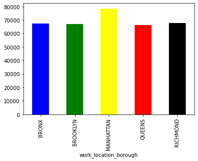

# NYC Payroll Analysis

Authors:  Pranav Pillai and Samir Nino


---

## Introduction

- This data consists of some of the information about the payrolls of Admin for Children's Services in NYC
- The source of this data is the new york city open data - https://data.cityofnewyork.us/resource/k397-673e.json  
- This data is as recent as the fiscal year 2021, and it is updated every fiscal year

---

## Sources

- The source code came from https://data.cityofnewyork.us/resource/k397-673e.json 

---

## Explanation of the Code

The code, `pranavpi_samirmic_payrollnyc.py`, begins by importing necessary Python packages:
```
import numpy as np
import pandas as pd
import json
import urllib.request
import matplotlib.pyplot as plt 
```

We then import data from https://data.cityofnewyork.us/resource/k397-673e.json.  We print the data to allow us to verify what we've imported:

```
	fiscal_year	payroll_number	agency_name	last_name	first_name	mid_init	agency_start_date	work_location_borough	title_description	leave_status_as_of_july_31	base_salary	pay_basis	regular_hours	regular_gross_paid	ot_hours	total_ot_paid	total_other_pay
0	2021	67	ADMIN FOR CHILDREN'S SVCS	HERNANDEZ	HILARY	M	2018-10-29T00:00:00.000	BRONX	CHILD PROTECTIVE SPECIALIST	ACTIVE	60327.0	per Annum	1820.0	59607.00	256.25	10285.72	1027.87
1	2021	67	ADMIN FOR CHILDREN'S SVCS	BLACKWELL	CATHY	NaN	2018-10-29T00:00:00.000	MANHATTAN	CHILD PROTECTIVE SPECIALIST	ON LEAVE	60327.0	per Annum	1484.0	48500.19	43.75	1632.34	780.31
2	2021	67	ADMIN FOR CHILDREN'S SVCS	WILLIAMS	FRANCICA	C	2006-04-10T00:00:00.000	BROOKLYN	CHILD PROTECTIVE SPECIALIST SUPERVISOR	ACTIVE	88627.0	per Annum	1820.0	88377.50	0.00	0.00	4245.78
3	2021	67	ADMIN FOR CHILDREN'S SVCS	DRUMGOLD	CHERYL D	NaN	1996-06-23T00:00:00.000	MANHATTAN	PRINCIPAL ADMINISTRATIVE ASSOCIATE - NON SUPVR	ACTIVE	67639.0	per Annum	1820.0	66862.72	0.00	0.00	4312.46
4	2021	67	ADMIN FOR CHILDREN'S SVCS	ADANRI	DONALD	A	2018-08-06T00:00:00.000	BROOKLYN	COMMUNITY COORDINATOR	ACTIVE	62215.0	per Annum	1820.0	60790.26	19.00	639.11	1800.57		
```
We filter the data by organizing the time units correctly and deleting unnecessary columns.

```
del df["payroll_number"]
del df["last_name"]
del df["first_name"]
del df["mid_init"]
del df["pay_basis"]
df['agency_start_date'] = pd.to_datetime(df['agency_start_date']).dt.year


Finally, we visualize the data.  We save our plot as a `.png` image:
```
jobs_description = df.groupby(['title_description'])['base_salary'].describe()
del jobs_description['count']
del jobs_description['std']
plt.boxplot(jobs_description)
plt.xticks([1, 2, 3, 4, 5, 6], ['mean', 'min', '25%', '50%', '75%', 'max' ])
plt.title('Jobs Information')
plt.xlabel('General Statistics')
plt.ylabel('Salary')
```

The output from this code is shown below:



---

## How to Run the Code
*Provide step-by-step instructions for running the code.  For example, I like to run code from the terminal:*
1. Open a terminal window.

2. Change directories to where `pranavpi_samirmic_payrollnyc.py` is saved.

3. Type the following command:
	```
	python pranavpi_samirmic_payrollnyc.py
	```


---

Suggestions

This data can be combined with historical data to show trends and forecasting into the future. We also just considered a small sample size and deemed some features as irrelevant to our current study, with more information, there could be more in depth analysis using different methods to help us better understand the historical data and predict future ones. The dataset contains only payroll for people employed in 2021 in Admin for Childrens' Services in New York City. If we use previous year's data or if we use different organizations or compare it to New York City as a whole, we can make a more in-depth comparision and data visualization such as violin plots.


Video Link:


https://ub.hosted.panopto.com/Panopto/Pages/Viewer.aspx?id=054b0a34-c046-4589-9474-ae8500f90198


