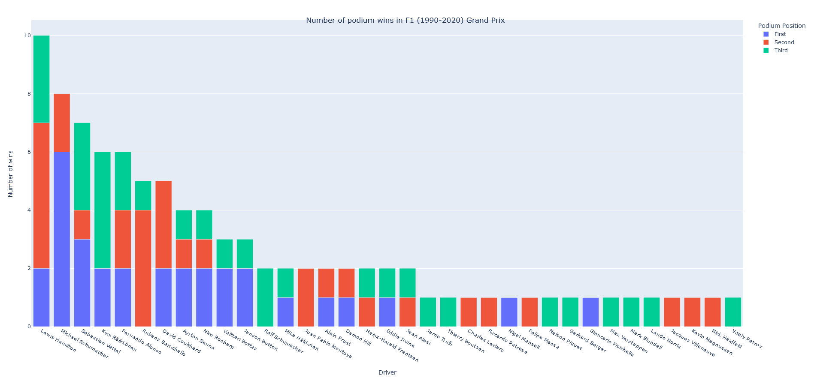

# Plotting F1 Grand Prix podium wins with the help of APIs

Authors:  Somit Desai , Sumanth Reddy, Vineeth Reddy Tati and Anirudh Varma \
Presentation: [Video](https://youtu.be/ggz6moRPRy4)

---

## Introduction
- We import F1 race data in .JSON format. 
- The data is fetched using requests from [F1 MRD Repo](http://ergast.com/mrd/)  
- This data is very recent and is updated every race.
- After fetching the data is cleaned and filtered for better visualization.
- We then render a graph of the given plot between drivers and their number of podium wins.

---

## Sources

- The code retrieves data from [F1 MRD Repo](http://ergast.com/mrd/)
- Numpy documentation [Documentation](https://numpy.org/doc/stable/index.html)
- Plotly documentation [Documentation](https://plotly.com/python/)

---

## Explanation of the Code
The code, `vineethr_syeruva_somitdes_apenumet_f1data.py`, begins by importing necessary Python packages:
```
import requests
import numpy as np
import plotly.graph_objects as go
```

Plotly can be installed through PIP with the following command:
```
pip install plotly
```

We then use requests to fetch data from the online data repo:
```
my_base_url = "http://ergast.com/api/f1/" + str(temp_year) + "/1/results.json"
response = requests.get(my_base_url)
data = response.json()['MRData']['RaceTable']['Races'][0]
```
We validate that the data is right by printing it out and checking it:
```
print(f"Year: {temp_year}, Race: {data['Circuit']['circuitName']}")
print(f"{x['position']}.{x['Driver']['givenName']} {x['Driver']['familyName']}")
```
This should give us a result like:
```
Year: 2019, Race: Albert Park Grand Prix Circuit
1.Valtteri Bottas 
2.Lewis Hamilton 
3.Max Verstappen 
```
The data then needs to be filtered and sepearated into useful data before we start visualizing it. This is done with the help of 
Numpy:

```
first = np.array(first_raw)
second = np.array(second_raw)
third = np.array(third_raw)

first_unique, first_counts = np.unique(first, return_counts=True)
second_unique, second_counts = np.unique(second, return_counts=True)    
third_unique, third_counts = np.unique(third, return_counts=True)
```

Finally, we visualize the data.  We render our plot in the browser using:
```
fig = go.Figure()
fig.add_bar(x=drivers, y=p1, name="First")
fig.add_bar(x=drivers, y=p2, name="Second")
fig.add_bar(x=drivers, y=p3, name="Third")
fig.show()
```

The output from this code is shown below:



---

## How to Run the Code
1. Open a terminal window.

2. Change directories to where `vineethr_syeruva_somitdes_apenumet_f1data.py` is saved.

3. Type the following command:
	```
	python vineethr_syeruva_somitdes_apenumet_f1data.py
	```
---

## Suggestions

For future work, it would be better if we can categorize by teams and then graph how the races have won team wise. Maybe adding a dynamic element by choosing specific races or courses. This would help us understand if there is a correlation between certain racetracks and team wins for example.
