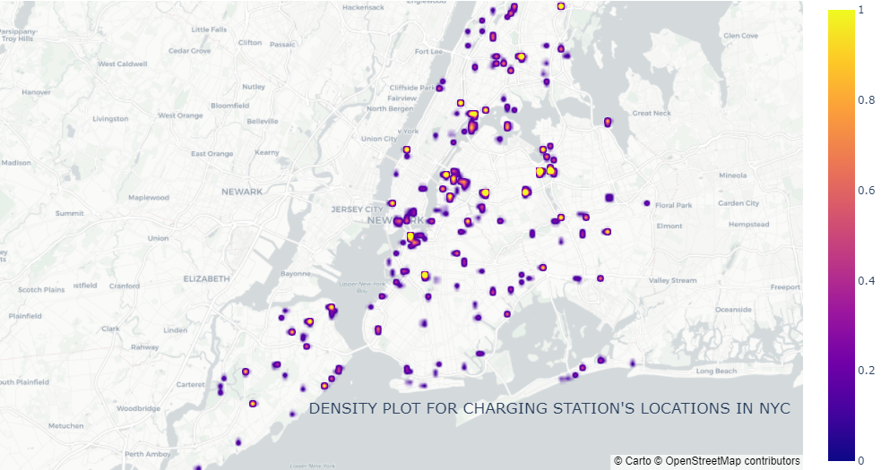
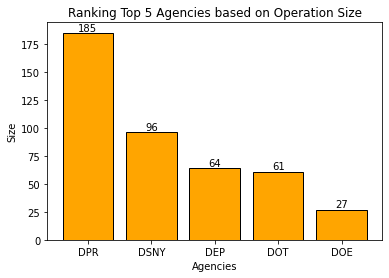
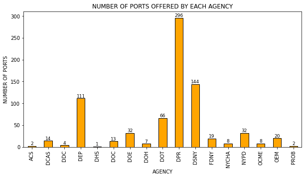
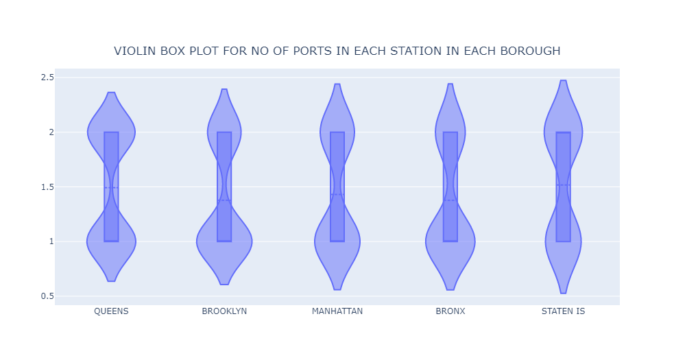
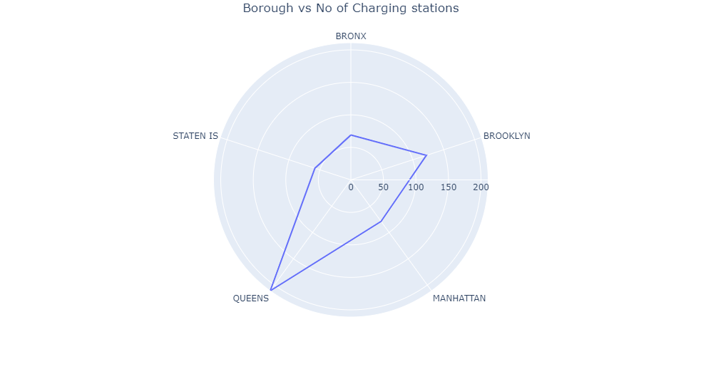
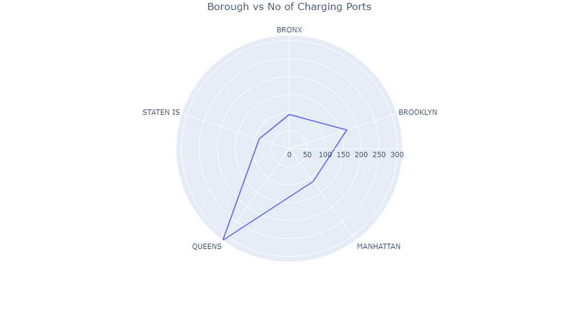
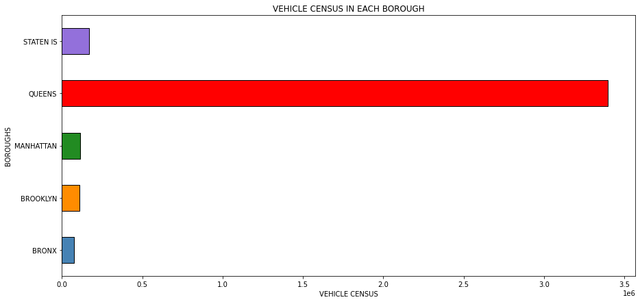
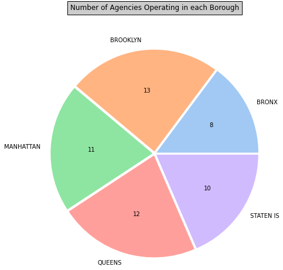

# VISUALIZATION AND ANALYSIS OF NYC EV FLEET STATION NETWORK

#### Team Members & GitHub links

- Srikant Jayasankaran         https://github.com/srikantvsj
- Priyanka Rajendra Bhoite     https://github.com/pbhoite94
- Sanath Viswanathan Srinivas  https://github.com/Sanath-Vis
- Siva Shankar Paramasivan     https://github.com/sparamas95

YOUTUBE VIDEO LINK: https://www.youtube.com/watch?v=qrXkBPZyV50

# 1. PROJECT SUMMARY

Charging infrastructure expansion is inevitable if the government's goal of a 50% electric car market share in new vehicle registrations by 2030 is to be met. The goal is to analyze the current fleet charging network in New York City and provide insights for future upgrades in EV infrastructure.The data is extracted from NYC Open Data. It contains information about the EV charging station network in NYC.

#### The following visualization is performed to analyze the data and arrive at the inference for future upgrades

1. Analyzing Charging Station location in NYC
2. Ranking Agencies based on operating size in NYC
3. Visualization of Charging Port Capacity of Each Agency
4. Analysis on number of charging ports in each Borough
5. Visualization of the location of stations with one and two charging points
6. Analyzing Charging Ports/Station Capacity in Boroughs
7. Vehicles Operating in each Borough
8. Agency Operation in Boroughs

# 2. SOURCES

- **Dataset Provider : Department of Citywide Administrative Services (DCAS)**

- **Dataset Owner    : NYC OpenData**

- **Source Link      : https://data.cityofnewyork.us/City-Government/NYC-EV-Fleet-Station-Network/fc53-9hrv**

- **API Endpoint     : https://data.cityofnewyork.us/resource/fc53-9hrv.json**

*We obtained the source from NYC OpenData. Extracted the data into python from API source given in the website*

**Note:** Please refer the above link for more detailed description of the data columns and rows. 

 # 3. Python Libraries and API Information

 plotly |
 seaborn |
 matplotlib |
 json |
 pandas | 
 numpy |
 Socrata from sodapy  

Authenticated client credentials required for importing dataset directly from the website 
Created a profile in socrato and obtained the following credentials - MyAppToken, username, password
Data returned as JSON from API and converted to Python dictionary by sodapy
Converting dictionaries to pandas DataFrame
Data Cleaning - Removed null values using dropna()
Converting variable's data types as required

##  3.1 VISUALIZATION

The data extracted in the previous steps are used to visualize, analyze the Electric Vehicle Fleet stations in New York City

### 3.1.1 Analyzing Charging Station location in NYC

The EV fleet charging stations are densely located in NYC. To understand these locations of charging stations in each borough, a density plot is being plotted. We can analyze if these locations of charging stations are optimally located for effective usage based on population in each borough.

plotting location data points of all charging stations as a scatterplot in a map using scattergeo() in plotly library

***Note: Hovering over the points in the above map provides us information of Borough, Agency operating in that borough, the lattitude and longitude of that charging station.***

From the above density plot, we can infer that most densely located charging stations are located mainly in Queens and Manhattan. These boroughs are highly populated. There is need for increased EV infrastructure to be located in these boroughs for increased service. 

*code citation: https://plotly.com/python/reference/densitymapbox/*

### 3.1.2 Ranking Agencies based on operating size in NYC

To find the top 5 agencies operating in NYC can be visualized by plotting a bar graph. The graph takes into account the operating size of stations installed in 5 boroughs on New York City by different agencies.  

Plotting bar graph- Agencies vs size using matplotlib library

The goal here is to rank top 5 agencies and hence first the count for each agency is calculated and then sorted in descending order.

From the above plot, Agency DPR and DSNY contribute significantly for EV charging service in NYC. 

*code citation: https://matplotlib.org/stable/api/_as_gen/matplotlib.pyplot.bar.html*

### 3.1.3  Visualization of Charging Port Capacity of Each Agency

The goal here is to visualize how many ports in EV charging stations does each agency in NYC provides

Grouping agencies by sum of no_of_ports offered by each agency

From the above graph, we can infer that DPR provides significantly higher number of charging ports in NYC followed by DSNY and DEP.

*code citation: https://pandas.pydata.org/pandas-docs/stable/reference/api/pandas.DataFrame.plot.bar.html*

### 3.1.4 Analysis on number of charging ports

The transition from internal combustion engines to electric vehicles will need the sufficient charging infrastructure. Each charging station has a different number of ports. Let's take a look at the three criteria of charging station, charging port capacity, and borough to see where we may make improvements in the future.

**3.1.4.1 Violin Plot**

The charging stations in each borough, which were grouped by the number of charging ports, were displayed using a violin plot.

creating a violin plot using plotly visualization library

We can observe from the violin plot that the number of stations with one port is higher in all boroughs than the number of stations with two ports. We could immediately see that each station's charging port capacity has to be increased to allow the seamless transition to EVs.

*code citation: https://plotly.com/python/violin/*

**3.1.4.2 Mapping using Folium visualization library**

The charging stations and their locations are projected on a map with color coding according to the station's charging port capacity

**Folium library** is used to create a map and visualize the related parameters in the previous violin plot.

folium.map() from folium library is used to project and differentiate the staions with number of ports offered

***Note: Hovering over the points in the above map provides us information of port capacity in that charging station.***

We could easily identify the position of charging stations on the above map, with just one charging port indicated in red circles. In heavily populated boroughs like Manhattan, Queens, and Bronx, more attention is needed to these charging stations in order to boost their capacity.

*code citation: https://gis.stackexchange.com/questions/203062/using-mapbox-tiles-with-folium*

### 3.1.6 Charging Port, Station Capacity in Boroughs
To understand the EV infrastructure in each borough, we are proceeding to visualize the charging port and charging station capacity in each burrow, by constructing a radar chart.

The no of ports are first grouped according to the boroughs in the dataframe. The plotly express line polar function is then utilized to arrive at the chart. Similarly, we a grouping the boroughs according to the station, to understand the station capacity in each borough and analyse their EV infrastructure capabilities.

Applying the plotly express line polar function to visualize the radar chart

From the radar chart above we understand that Queens is best equipped to handle the EV needs for charging. They lead in both the maximum number of charging ports and stations followed by Brooklyn. We understand that the EV infrastructure is lacking in Bronx, Manhattan ,Staten Island and need to increase the station and port capacity

*code citation: https://plotly.com/python/radar-chart/*

### 3.1.7 Vehicles Operating in each Borough
We can see in the Radar Chart that Queens has the most developed EV Infrastructure. This makes us want to understand which borough has the highest census count.

For this purpose, we are using the groupby function for the boroughs in reference to the census_tract and plotting a horizontal bar chart using the matplotlib package. The X-axis represents the census and the Y-axis represents the 5 boroughs 

Plotting a horizontal bar chart using matplotlib library

From the above graph, we understand that Queens has the highest census count operating within, compared to other boroughs. Since the census count in Queens is high, this would mean that Queens would need to have the strongest EV Infrastructure, which is synonymous with our inference from the Radar chart that Queens is best equipped with lots of charging stations and ports.

*code citation: https://datatofish.com/horizontal-bar-chart-matplotlib/*

### 3.1.8 Agency Operation in Boroughs
Here we are trying to visualize the number of agencies that are operating in each borough using a pie chart.

Firstly, we are grouping the agnecies according to the boroughs they operate in using the pandas groupby function. We are then utilizing the Seaborn visualization library to create a pie chart. It should be noted that we are displaying only the absolute values in the pie chart and not the percentages.

created pie chart using pie() from matplotlib library

From the above pie-chart we understand that queens is the most operation friendly borough as the highest no of agencies operate in Queens. We can see that Bronx has the lowest count. This could be due to the lower population count in Bronx compared to the other boroughs.

*code citation: https://www.statology.org/seaborn-pie-chart/*

## Conclusion

- Based on the analysis, It can be infered that the government is lagging behind their set target. Improvement has to be done in EV infrastructure to aid smooth transition into Electric Vehicles and reduce carbon emmisions.

- This analysis highlights the major areas that should be concentrated on to achieve the government's objective with optimal resource utilization.**

